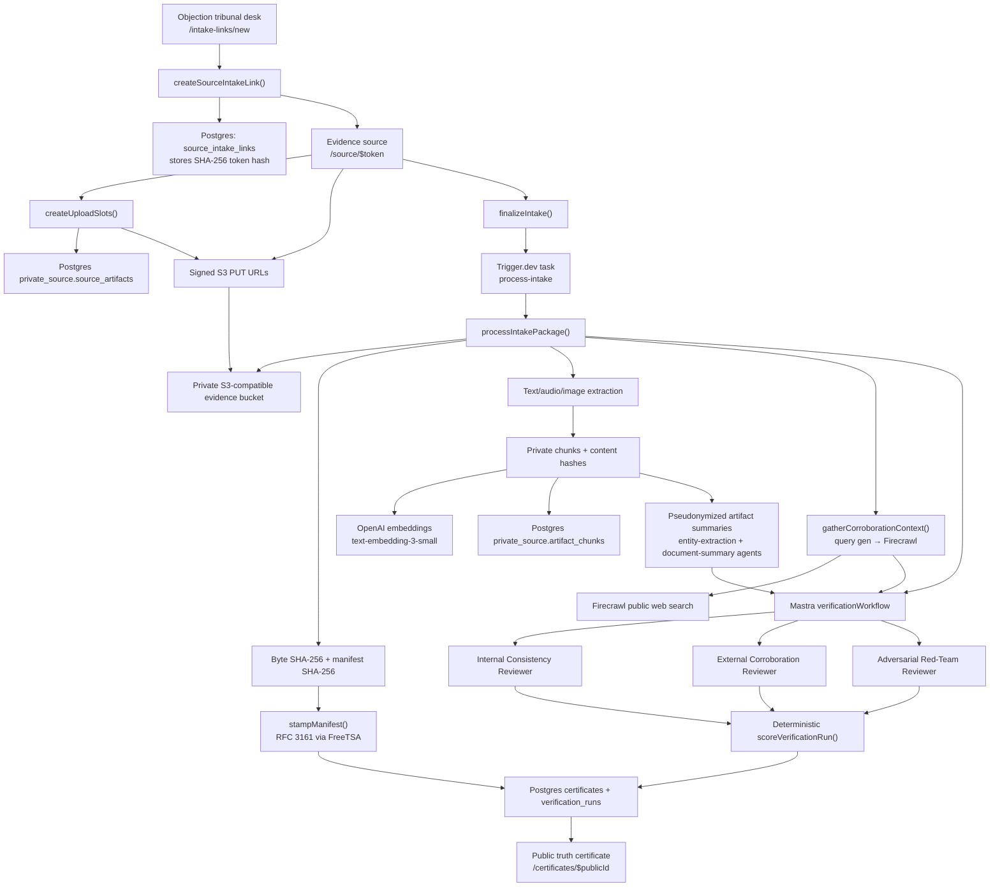

# Objection - The AI Tribunal of Truth

Privacy-preserving tribunal for contested media claims. Objection accepts private evidence, records provenance signals, runs structured AI review, and publishes a public truth certificate with copy-ready attribution language.

This project is intentionally framed as a tribunal record, not an oracle. It does not certify that an allegation is true. It documents what was uploaded, when it entered the system, how the materials were processed, what consistency and corroboration checks were performed, what concerns remain, and which public attribution language is safe to use.

## Submission Notes

- Deployed link: https://objection-roan.vercel.app
- Loom walkthrough: https://www.loom.com/share/5df599ea144148299f3e0127de4ba319

## Assignment Context

The challenge is to help people dispute contested media claims without exposing raw source material or overstating what the system can prove. Uploaded packages can contain many artifact types, including notes, correspondence, documents, media, and structured data.

The hard part is provenance. A plain hash proves only that a file has a certain byte representation after hashing. It does not prove when the file existed, how it entered the system, or whether a reporter can safely describe it in public. This implementation treats provenance as a chain of custody problem:

- Anonymous intake is mediated through a one-time capability link.
- Uploads go directly to private object storage using server-issued signed URLs.
- The server reads the stored object, hashes the bytes, extracts private text, chunks and hashes the content, and records a package manifest hash.
- The review methodology is versioned and hash-addressed.
- The public truth certificate exposes only sanitized labels, public-safe summaries, confidence tiering, red-team concerns, and attribution snippets.

## Product Flow

1. A case handler operates from `/dashboard` (the live tribunal desk listing every channel, every in-flight package, and every published certificate) and creates a one-time evidence channel inline or via `/intake-links/new`.
2. The source opens `/source/$token` and uploads evidence without creating an account or providing identity details.
3. The app creates S3 upload slots, stores only a hash of the source token, and registers private artifact rows.
4. On finalization, the server enqueues a Trigger.dev `process-intake` task and returns immediately. The task runs on Trigger.dev's worker infrastructure (not on Vercel), reads each uploaded object, calculates SHA-256, extracts text or transcript-like content, chunks the content, hashes chunks, and creates embeddings.
5. Each artifact is summarized through the document-summary agent after the entity-extraction agent builds a per-package pseudonym dictionary; the public-safe summary is what every downstream reviewer sees.
6. The server builds a package manifest, hashes it, and anchors the manifest hash via RFC 3161 against FreeTSA.
7. A Mastra adjudication workflow runs three reviewer agents in parallel against the pseudonymized summaries and Firecrawl-supplied public sources.
8. A deterministic scoring step converts structured reviewer findings into a reliability tier.
9. A public truth certificate is stored and shown at `/certificates/$publicId`.
10. The truth certificate presents a privacy-preserving dossier, provenance ledger with click-to-copy hashes and timestamps, claim matrix, red-team concerns, and copy-ready attribution language. The first attribution snippet follows the brief's pattern (`"<verified claim>," said a source verified via Objection's independent certification process.`).

## Architecture



## Main Subsystems

### Frontend and Routes

The app uses TanStack Start with file-based routes:

- `/` presents Objection and links to the tribunal desk.
- `/intake-links/new` is the case intake console for creating evidence channels.
- `/source/$token` is the private evidence upload page.
- `/jobs/$jobId` shows adjudication workflow status.
- `/certificates/$publicId` renders the public truth certificate.
- `/methodology` exposes the versioned scoring method and methodology hash.

### Data and Storage

Drizzle models the public and private sides separately:

- `source_intake_links` stores hashed capability tokens and expiry state.
- `evidence_packages` stores pseudonymous package records, manifest hash, anchor status, and public file references.
- `private_source.source_artifacts` stores original filename, S3 object key, extracted raw text, SHA-256, and private metadata.
- `private_source.artifact_chunks` stores private review chunks, content hashes, and embeddings.
- `verification_runs` stores methodology version/hash, workflow state, and raw structured findings.
- `certificates` stores the public truth certificate payload and attribution snippets.

The split is deliberate: public routes can show a truth certificate without exposing source identity, original filenames, raw transcripts, full notes, or raw evidence.

### Evidence Intake and Provenance

The intake flow is implemented in `src/lib/intake.ts`.

The source receives a bearer-style capability token. The database stores only `sha256(token)`, so the token cannot be recovered from the database row. The token expires and is marked used after finalization.

For each uploaded file, the server creates a signed S3 PUT URL and a private artifact row. On finalization, the server creates a queued `verification_runs` row and enqueues the `process-intake` Trigger.dev task ([src/trigger/processIntake.ts](src/trigger/processIntake.ts)) with the `packageId` and `runId`. The task runs `processIntakePackage()` off the request path — required because the Vercel function exits as soon as the response is returned, so any in-process background work after the response is silently dropped. The task itself reads the object back from storage, calculates the SHA-256 of the actual stored bytes, extracts content, chunks the extracted content, hashes each chunk, embeds chunks when the embedding API is available, and creates a package manifest:

```txt
manifest = {
  packageId,
  intakeTs,
  methodologyHash,
  files: [{ artifactId, label, mimeType, sizeBytes, sha256 }]
}
manifestHash = sha256(JSON.stringify(manifest))
```

The manifest hash is then anchored externally. `stampManifest()` in [src/lib/anchor.ts](src/lib/anchor.ts) hand-encodes an RFC 3161 `TimeStampReq` for the SHA-256 digest and POSTs it to FreeTSA (`https://freetsa.org/tsr`). On success the certificate stores the base64 TSA token, the TSA URL, and the response certs as an `AnchoredProof`; on timeout, HTTP error, or empty response the anchor falls soft to an `UnavailableProof` with the failure note and `attemptedAt` timestamp, so a certificate is never blocked by FreeTSA being down.

This does not fully solve provenance by itself. The improvement over "hashing a file after creating it" is that the hash is produced by the receiving system after upload, tied to a server intake timestamp, package ID, private object key, manifest, methodology version, and a third-party RFC 3161 timestamp token.

## How The AI Works

The review engine is a Mastra workflow registered in `src/mastra/index.ts` and implemented in `src/mastra/workflows/verification-workflow.ts`.

The workflow input is:

- `packageId`
- `artifactContext`
- `externalSources` — a formatted block of public-web search results

### Pre-workflow: artifact summarization and pseudonyms

Before any reviewer sees an artifact, the intake pipeline runs a privacy-preserving summarization layer so real names and identifiers never reach the workflow. This step lives in [src/mastra/verification/document-summary.ts](src/mastra/verification/document-summary.ts) and is invoked from [src/lib/intake.ts](src/lib/intake.ts) during `processIntakePackage()`:

1. The **entity-extraction agent** ([src/mastra/agents/entity-extraction-agent.ts](src/mastra/agents/entity-extraction-agent.ts)) pulls people, organizations, emails, phone numbers, and street addresses out of the extracted text. Entities are merged across artifacts so the same person isn't re-pseudonymized in every document.
2. [src/mastra/verification/pseudonyms.ts](src/mastra/verification/pseudonyms.ts) builds a per-package dictionary: people become `Person A`, `Person B`, …; organizations become `Org α`, `Org β`, …; pairs and contact strings get stable substitutions.
3. The **document-summary agent** ([src/mastra/agents/document-summary-agent.ts](src/mastra/agents/document-summary-agent.ts)) produces a public-safe description of each artifact under the constraint that it must use pseudonyms, never raw names, emails, or phone numbers.
4. The output is re-swept against the dictionary plus PII regexes (email, phone, SSN, credit card) so anything the agent leaked is replaced before persistence.

The pseudonymized summaries are what the three reviewer agents downstream operate on, and what `fallbackCertificatePayload()` uses if the workflow step degrades.

### Public-web corroboration

`gatherCorroborationContext()` in `src/lib/corroboration.ts` extracts 3-5 public-only search queries from the artifact context (`gpt-4o-mini`, JSON mode, with an explicit prompt that forbids source-identifying terms), runs each through Firecrawl, dedupes results by URL, caps at 12 sources, and produces the formatted prompt block. The structured `ExternalSource[]` is also stashed on the truth certificate so the public siderail still lists what was searched even if the agent step degrades. Firecrawl or LLM failures fail soft to the "no public sources supplied" string.

### Three-reviewer parallel workflow

The Mastra workflow then runs three reviewer steps in parallel:

1. `internal-consistency`
   - Agent: Internal Consistency Reviewer.
   - Goal: compare claims across uploaded artifacts, reconcile timelines, identify entity consistency, and surface contradictions.
   - Output schema: `internalConsistencyOutputSchema`.

2. `external-corroboration`
   - Agent: External Corroboration Reviewer.
   - Goal: classify the Firecrawl-supplied public sources against entities and claims in the evidence context.
   - Output schema: `externalCorroborationOutputSchema`.
   - Constraint: use only the supplied public sources and never invent URLs.

3. `red-team`
   - Agent: Adversarial Red-Team Reviewer.
   - Goal: argue that the package may be fabricated, incomplete, misleading, or over-weighted.
   - Output schema: `redTeamOutputSchema`.
   - Constraint: every concern must cite artifact chunks and be safe to publish.

Each reviewer uses structured output so downstream scoring receives typed JSON rather than free-form prose. If a reviewer call fails, the system uses metadata-only findings and marks the path as degraded. That path records processing facts without inventing content-specific claims.

## Scoring and Truth Certificate Logic

The scoring function is deterministic and lives in `src/mastra/verification/scoring.ts`. This is a deliberate separation: AI reviewers gather structured findings, but the final tier is assigned by explicit code.

The tiers are:

- `Substantiated`: key factual anchors were externally verified and there are no material unresolved concerns.
- `Corroborated`: multiple uploaded artifacts and public sources support the core claim, with limits disclosed.
- `Single-source`: the package is internally coherent, but the material remains source-controlled or only partially corroborated.
- `Disputed`: material contradictions, external conflicts, or blocking concerns prevent reliance on the package.

The truth certificate payload includes:

- confidence score
- tier and tier definition
- provenance ledger
- artifact summaries
- claim matrix
- timeline
- external checks
- red-team concerns
- privacy redactions
- attribution snippets

The 0-100 confidence score is computed in `src/mastra/verification/fallback.ts` (`confidenceScore`) from the same reviewer findings the tier uses, but separately so the two signals can disagree visibly:

- base 78
- minus 12 per high-severity red-team concern
- minus 6 per medium-severity red-team concern
- minus 4 per limit reported by the external-corroboration reviewer
- plus 2 per internally cited core claim, capped at +8
- clamped to 0-100

The intended public output is not "this source is correct." It is closer to: "this evidence package was reviewed through this method, reached this tier, with this score, and has these caveats."

## Privacy Model

The truth certificate is designed to be useful to readers without exposing sensitive source material.

Public output may include:

- sanitized artifact labels and evidence type
- per-artifact SHA-256 (click-to-copy on the certificate)
- manifest hash, methodology hash, methodology version, intake and finalized timestamps (all click-to-copy)
- public-safe paraphrases and excerpts
- structured claim support and timeline events
- public source URLs from the corroboration step
- red-team concerns
- copy-ready attribution language

The truth certificate UI was deliberately stripped of processing trivia. It no longer surfaces MIME types, byte sizes, chunk counts, embedding counts, or processing summaries — that detail belongs to the private review record, not the public artifact.

Public output must not include:

- source identity
- original filenames
- raw uploaded files
- raw audio
- full transcripts
- private extracted text
- private chunk contents
- S3 object keys
- secret tokens or API keys

## Why This Over Alternatives

### Multi-agent review over one monolithic verdict

A single "verification agent" would be simpler, but it would blur different tribunal tasks. This system separates consistency review, public corroboration, and adversarial review so the truth certificate can show how each dimension affected the final tier.

### Deterministic scoring over AI-only judgment

The model should not get the final uninspectable vote on reliability. The AI outputs structured findings; the tiering logic is code. This makes the system easier to test, explain, and revise.

### Public-safe certificates over raw evidence release

Publishing raw evidence could expose a source, a witness, private correspondence, or other sensitive details. The truth certificate gives readers a verifiable review artifact without turning the evidence package into a public leak.

### Manifest and methodology hashes over naked file hashes

Hashing individual files is necessary but not sufficient. The implementation also hashes a package manifest and pins it to a methodology hash, making the review reproducible at the process level: which files, which method, which timestamp, which truth certificate.

### Workflow orchestration over ad hoc API calls

Mastra gives the review engine a typed workflow, parallel execution, registered agents, observability, storage, and a clear path toward Studio/debug tooling. That is a better foundation than scattered server functions calling models directly.

## Known Gaps and Time Boxing Notes

Several production-grade pieces are intentionally represented as architecture hooks rather than completed systems.

- Large-input handling is bounded and runs in-process. The intake pipeline applies hard-coded character caps before agents see content: entity extraction truncates at 12,000 characters ([src/mastra/verification/pseudonyms.ts](src/mastra/verification/pseudonyms.ts)), document summarization truncates at 12,000 characters ([src/mastra/verification/document-summary.ts](src/mastra/verification/document-summary.ts)), and each reviewer prompt embeds only a 6,000-character raw-text excerpt per artifact ([src/lib/intake.ts](src/lib/intake.ts)). This creates a real privacy ceiling: real names or PII appearing after the first 12 KB of a long document never enter the per-package pseudonym dictionary, so they can survive into downstream prompts. Embedding chunks are also character-sized (4,800 / 600 overlap) rather than tokenizer-aware, and `embedChunks()` returns empty arrays on failure with no flag or degraded-state marker ([src/lib/extraction.ts](src/lib/extraction.ts)), so an oversized or rate-limited chunk silently produces a non-searchable artifact. The supported file matrix is also narrow — text/markdown/CSV/JSON, PDF (via `unpdf`), audio (via `gpt-4o-transcribe`), image (via `gpt-5.5`), and DOCX (via `mammoth`); anything else is hashed and retained but not text-extracted. Production would lift extraction and the pre-workflow agent passes out of the main TanStack server and into a sandboxed execution environment such as Modal or E2B. That gives per-job CPU/memory/time isolation for very large or hostile inputs (500-page PDFs, multi-hour audio, scanned image stacks, archive bundles), allows a much wider file matrix (XLSX, EML with attachments, video keyframes, OCR over scanned docs, archive expansion) without dragging new native dependencies into the main server's blast radius, removes the "first 12 KB only" privacy ceiling by letting entity extraction and summarization fan out across all chunks of an artifact in parallel, and gives a clean place to enforce per-job resource ceilings, network egress allowlists, and ephemeral filesystems so a malicious upload cannot exfiltrate or persist state. The main server would then only schedule jobs, receive structured results, and persist the certificate — keeping the trust boundary thin.
- External timestamp anchoring is implemented against a single TSA (FreeTSA). Production would want multiple TSAs, periodic re-anchoring, and an in-app verifier that re-checks the TSA token rather than trusting the stored `AnchoredProof` field.
- Public corroboration is now wired end-to-end through Firecrawl, but results are not cached or snapshotted, so a re-review against the same source URL months later may see different content. Reproducibility requires snapshot storage.
- Email authenticity checks are limited. The system can analyze text consistency, but it does not verify DKIM, SPF, full headers, mailbox server logs, or original `.eml` chains.
- Audio authenticity checks are limited. Audio can be transcribed, but the system does not verify speaker identity, detect edits, or run acoustic forensics.
- Source-device provenance is not captured. There is no mobile capture flow, hardware attestation, secure timestamping at capture time, or trusted upload client.
- Metadata-only findings are used for resilience. If live reviewer calls fail, the system can still produce public output from upload and processing metadata without inventing content-specific summaries.
- The public truth certificate does not include revocation, supersession, or re-review states.
- There is no production legal review, case approval queue, abuse handling, moderation workflow, or secure source communication channel.
- The app stores private extracted text and chunks in Postgres. Production would need stricter retention, encryption, access control, and deletion policies.

## What I Would Do Next

1. Harden timestamp anchoring.
   - Anchor against more than one TSA (FreeTSA + DigiCert/SecureTrust) so a single TSA outage doesn't downgrade the proof.
   - Add an in-app TSA-token verifier so the certificate page can re-prove the anchor rather than trust the stored value.
   - Re-anchor on methodology version bumps to keep the chain current.

2. Strengthen capture provenance.
   - Add a source-side guided capture flow for photos, recordings, emails, and documents.
   - Record client-side capture metadata where safe.
   - Distinguish "uploaded artifact" from "captured in-session artifact."

3. Add audio review depth.
   - Store transcript confidence.
   - Detect obvious edit boundaries.
   - Allow case-handler-supplied witness context without exposing identity.
   - Represent speaker verification as an explicit missing or complete check.

4. Strengthen external corroboration. (The base path now extracts public-only queries with `gpt-4o-mini`, fans them out through Firecrawl, dedupes, and feeds the formatted block to the reviewer — see `src/lib/corroboration.ts`.)
   - Cache source snapshots so certificates remain reproducible after Firecrawl results change.
   - Distinguish "public-web context" from "verification of the underlying allegation" explicitly in the UI.
   - Add per-source confidence scoring based on domain authority and recency.

5. Add human tribunal review.
   - Queue truth certificates for approval before publication.
   - Let reviewers downgrade tiers, redact snippets, and add case notes.
   - Preserve every change in an audit log.

6. Add truth certificate lifecycle controls.
   - Support revocation, superseded truth certificates, re-runs under a new methodology version, and public change history.

7. Harden privacy and operations.
   - Encrypt private extracted text and chunks.
   - Add role-based access control.
   - Add retention windows and deletion workflows.
   - Add structured observability that excludes source-sensitive content.

## AI Workflow and Tools

Objection uses Mastra for workflow orchestration; OpenAI for pre-workflow entity extraction and document summarization, the three parallel reviewer agents, audio transcription (`gpt-4o-transcribe`), image summarization, embedding (`text-embedding-3-small`), and public-query extraction (`gpt-4o-mini`, JSON mode); Firecrawl for public-web corroboration search; FreeTSA over RFC 3161 for manifest anchoring; Trigger.dev for off-request background execution of `processIntakePackage()` so the Vercel function returns immediately while the long-running intake pipeline runs on Trigger.dev's worker infrastructure; Drizzle and Postgres for state; S3-compatible object storage for private evidence; and TanStack Start for the product surface.

## Local Development

Install dependencies:

```bash
bun install
```

Run the app:

```bash
bun --bun run dev
```

In a second terminal, run the Trigger.dev dev worker so the `process-intake` task can pick up enqueued jobs locally:

```bash
bunx trigger.dev@latest dev
```

Without this worker running, intake submissions will be enqueued but stay at `status: "queued"` because nothing will execute the task. On Vercel preview/production the worker runs in Trigger.dev's cloud and is decoupled from the deploy.

Open:

```txt
http://localhost:3000
```

Build:

```bash
bun --bun run build
```

Deploy Trigger.dev tasks to the prod environment (run once per task change):

```bash
bunx trigger.dev@latest deploy
```

## Testing

The suite is Vitest 4, run through Bun.

```bash
# run every test once
bun --bun run test
```

### How the suite is wired

- Test runner is Vitest 4.1; there is no separate `vitest.config.ts` — Vitest picks up [vite.config.ts](vite.config.ts) and runs in its default Node environment. `jsdom` is installed for any future DOM-dependent test.
- The suite is fully offline. No live HTTP, no real Postgres, no real S3, no live agent calls. Anything that would otherwise hit the network or the database is mocked.
- Database access is stubbed with `vi.mock("../db", …)` and `vi.hoisted()` mock factories — see [src/lib/intake.test.ts](src/lib/intake.test.ts) for the canonical pattern.
- Network calls (FreeTSA, Firecrawl, OpenAI) are stubbed with `vi.stubGlobal("fetch", …)` and `vi.unstubAllGlobals()` in teardown — see [src/lib/anchor.test.ts](src/lib/anchor.test.ts).
- Env-dependent code reads through `parseServerEnv()` in [src/env.ts](src/env.ts); pass a mock config object in tests rather than mutating `process.env`.

### What the suite covers

- [src/env.test.ts](src/env.test.ts) — `parseServerEnv()` accepts a complete config and rejects missing-required-key cases (DATABASE_URL, S3_*, OPENAI_API_KEY, FIRECRAWL_API_KEY).
- [src/lib/anchor.test.ts](src/lib/anchor.test.ts) — RFC 3161 `TimeStampReq` DER encoding for SHA-256 digests, FreeTSA round-trip under mocked `fetch` for success / timeout / 404 / empty-body, and invalid-digest rejection.
- [src/lib/intake.test.ts](src/lib/intake.test.ts) — `createUploadSlots()` refuses new uploads once a package has been summarized and sealed (`summarizationSealedAt` is non-null).
- [src/lib/corroboration.test.ts](src/lib/corroboration.test.ts) — pure per-fact prompt-block formatter: empty-fact sentinel, per-fact URL dedup, per-fact cap of 4, global results cap, non-`http*` URL filtering, and the "no sources" wording when every query came back empty.
- [src/mastra/verification/scoring.test.ts](src/mastra/verification/scoring.test.ts) — deterministic tier transitions (`Single-source` ↔ `Disputed` ↔ `Corroborated` ↔ `Substantiated`) driven by verification ratios and red-team severity, plus citation invariants on internal/external/red-team reviewer outputs.
- [src/mastra/verification/fallback.test.ts](src/mastra/verification/fallback.test.ts) — `fallbackCertificatePayload()` shape, brief-pattern attribution snippet ordering, seeded Firecrawl sources surfacing as `externalChecks` without exposing filenames, alias dedup, and pseudonym sweep of real names from public fields.
- [src/mastra/verification/pseudonyms.test.ts](src/mastra/verification/pseudonyms.test.ts) — entity matching (case-insensitive variants), dictionary generation (Person A–Z, Org α–ω, pairs), longest-variant replacement (no word-boundary bleed), and PII redaction for emails, phone numbers, SSNs, and credit cards.
- [src/mastra/verification/schemas.test.ts](src/mastra/verification/schemas.test.ts) — regression guard that `externalCorroborationOutputSchema` does not emit OpenAI-incompatible `uri` format fields when serialized for structured output.
- [src/mastra/verification/document-summary.test.ts](src/mastra/verification/document-summary.test.ts) — `summarizeArtifactWithPseudonyms()` sweeps real names from agent output using the per-package pseudonym dictionary and records the entity merge log.

### When adding a test

- Keep it deterministic: no live agents, no real S3, no real Postgres, no real Firecrawl. If the code under test touches one of those, mock at the module boundary.
- If the unit lives in [src/lib/intake.ts](src/lib/intake.ts), copy the `vi.hoisted()` + `vi.mock("../db", …)` pattern rather than threading a fake DB through arguments.
- If the unit makes an outbound HTTP call, stub `globalThis.fetch` and tear down with `vi.unstubAllGlobals()` in `afterEach`.
- The CI script is just `vitest run`; there is no separate `test:watch` or `test:coverage` script in `package.json` — use the `bun --bun x vitest …` invocations above.

## Environment Variables

The server validates environment variables in `src/env.ts`.

```bash
DATABASE_URL=
S3_ENDPOINT=
S3_REGION=
S3_BUCKET=
S3_ACCESS_KEY_ID=
S3_SECRET_ACCESS_KEY=
OPENAI_API_KEY=
FIRECRAWL_API_KEY=

# Trigger.dev — required so finalizeIntake() can enqueue process-intake
# Use the dev key locally and the prod key on Vercel production.
TRIGGER_SECRET_KEY=

# Optional Mastra Platform observability
MASTRA_PLATFORM_ACCESS_TOKEN=
MASTRA_PROJECT_ID=
```

`TRIGGER_SECRET_KEY` only needs to be set on the side that **enqueues** the task (local dev server and Vercel). The Trigger.dev worker side runs in Trigger.dev's cloud and reads env from the project dashboard — copy `DATABASE_URL`, `S3_*`, `OPENAI_API_KEY`, and `FIRECRAWL_API_KEY` into both Dev and Prod environments there so `processIntakePackage()` has what it needs to run.

Never commit `.env` files or secrets.

## Useful Files

- [src/lib/intake.ts](src/lib/intake.ts): evidence channels, upload slots, finalization, document summarization, manifest anchoring, workflow execution, truth certificate persistence.
- [src/trigger/processIntake.ts](src/trigger/processIntake.ts): Trigger.dev `process-intake` task that runs `processIntakePackage()` off the Vercel request path, with retry config and `markRunFailed()` fallback on terminal error.
- [trigger.config.ts](trigger.config.ts): Trigger.dev project config (`maxDuration`, retry defaults, `dirs: ["./src/trigger"]`).
- [src/lib/extraction.ts](src/lib/extraction.ts): text extraction, audio transcription, image summarization, chunking, embeddings.
- [src/lib/corroboration.ts](src/lib/corroboration.ts): public-query generation, Firecrawl fan-out, dedup, prompt-block formatting.
- [src/lib/firecrawl.ts](src/lib/firecrawl.ts): Firecrawl SDK wrapper that returns structured `ExternalSource` objects.
- [src/lib/anchor.ts](src/lib/anchor.ts): RFC 3161 `TimeStampReq` encoding and FreeTSA round-trip with soft fallback to `UnavailableProof`.
- [src/lib/security.ts](src/lib/security.ts): capability tokens, token hashing, SHA-256 helpers, public IDs.
- [src/db/schema.ts](src/db/schema.ts): public and private Postgres schema.
- [src/mastra/index.ts](src/mastra/index.ts): Mastra registration for workflows and agents.
- [src/mastra/workflows/verification-workflow.ts](src/mastra/workflows/verification-workflow.ts): parallel reviewer workflow and certificate merge step.
- [src/mastra/agents/document-summary-agent.ts](src/mastra/agents/document-summary-agent.ts) and [src/mastra/agents/entity-extraction-agent.ts](src/mastra/agents/entity-extraction-agent.ts): pre-workflow summarization and entity extraction.
- [src/mastra/agents/internal-consistency-agent.ts](src/mastra/agents/internal-consistency-agent.ts), [src/mastra/agents/external-corroboration-agent.ts](src/mastra/agents/external-corroboration-agent.ts), [src/mastra/agents/red-team-agent.ts](src/mastra/agents/red-team-agent.ts): the three reviewer agents.
- [src/mastra/verification/document-summary.ts](src/mastra/verification/document-summary.ts): orchestrates entity extraction → dictionary build → agent summary → pseudonym sweep.
- [src/mastra/verification/pseudonyms.ts](src/mastra/verification/pseudonyms.ts): entity matching, dictionary generation (Person A–Z, Org α–ω), PII redaction.
- [src/mastra/verification/scoring.ts](src/mastra/verification/scoring.ts): deterministic tiering logic.
- [src/mastra/verification/fallback.ts](src/mastra/verification/fallback.ts): confidence-score formula, metadata-only fallback findings, attribution snippets.
- [src/mastra/verification/schemas.ts](src/mastra/verification/schemas.ts): Zod schemas for reviewer findings and public truth certificate payload.
- [src/routes/index.tsx](src/routes/index.tsx): Objection homepage with tribunal desk CTA and process strip.
- [src/routes/dashboard.tsx](src/routes/dashboard.tsx): live tribunal desk listing every truth certificate, every in-flight package, every awaiting-upload link, with inline evidence-channel creation.
- [src/routes/certificates.$publicId.tsx](src/routes/certificates.$publicId.tsx): public truth certificate rendering with click-to-copy fields.

## Bottom Line

Objection should not be presented as magic truth detection. It should be a transparent, versioned, privacy-preserving tribunal record: what entered the system, what was checked, what corroborated, what failed or remained unknown, and what can responsibly be said in public.
